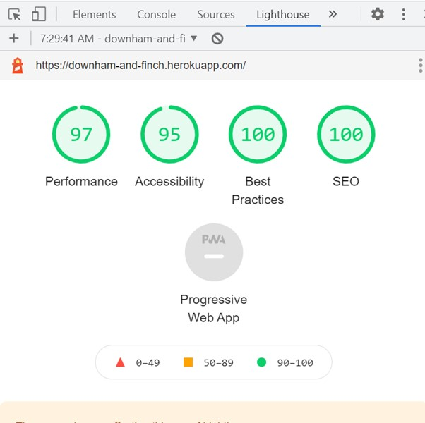
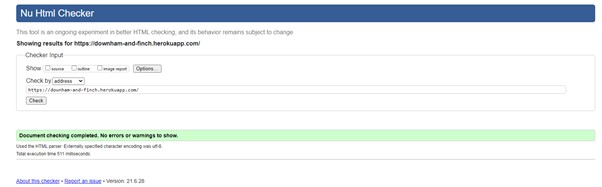
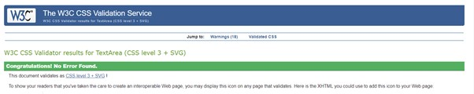
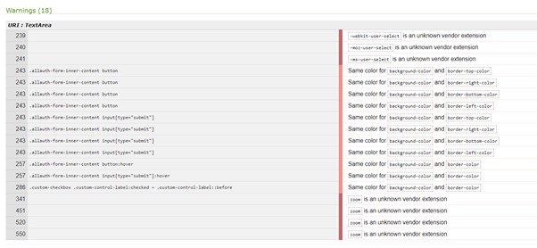
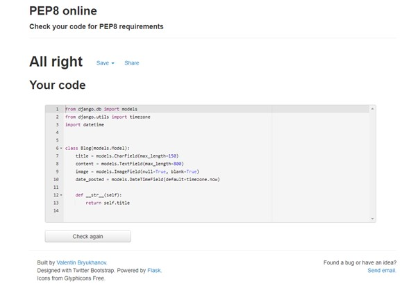
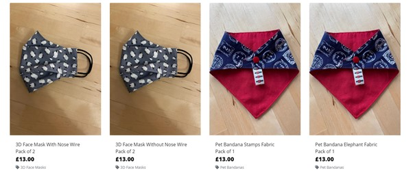
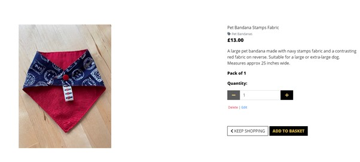

# Downham and Finch Testing:

The Downham and Finch site was tested extensively, using the following processes:

## Table of Contents:

- [Chrome Developer Tools](#Chrome-Developer-Tools)
- [Lighthouse](#Lighthouse)
- [W3c Markup Validation Service](#W3c-Markup-Validation-Service)
- [W3c CSS Validation Service](#W3c-CSS-Validation-Service)
- [JSHint](#JSHint)
- [Python Validation](#Python-Validation)
- [Automated Testing](#Automated-Testing)
- [Testing the User Stories](#Testing-the-User-Stories)
- [Testing Stripe Payments](#Testing-Stripe-Payments)
- [Manual Cross Browser Compatibility Testing](#Manual-Cross-Browser-Compatibility-Testing)

### Chrome Developer Tools:

- Chrome developer tools was used regularly to check the layout, and to check the console for errors.

### Lighthouse:

- The 'Lighthouse' function in Chrome Developer Tools was used to check the site's performance.

### W3C Markup Validation Service:

- The W3C Markup Validation Service was used to check that HTML used for the site was compliant with modern standards. 
The code passed the validator's tests with no errors or warnings:

### W3c CSS Validation Service:

- The W3C CSS Validation Service was used to check that HTML used for the site was compliant with modern standards. 
The code passed the validator's tests with no errors:

There were, however, a number of warnings. These mainly related to the use of 'allauth' - so were beyond my control.
There were additional warnings due to the use of 'zoom' that was used to make the images aesthetically pleasing on the site.

### Python Validation:

- Flake8 was used to check for any errors in the Python code, and where appropriate it was refactored. Migrations
were not refactored, nor was any code where the variables or file names made the lines too long. All other 
Python code was passed through the [Pep8 Online Linter](#http://pep8online.com/), where it passed with no errors or 
warnings.

### Testing the User Stories:

- User Story 1 is concerned with being able to view products on the site:

Test Case 1
Ensure that the products on the all products page render as expected, with image, display name, quantity in pack, price and product type clearly visible.
Expected Result: Products should render as described above.
Actual Result: Products render as described above.
Pass/Fail: Pass.

- User Story 2 is concerned with viewing individual products:

Test Case 2
Ensure that all products render as expected, with image, display name, quantity in pack, price, sizes (if applicable), quantity input selector,
product description and product type clearly visible.
Expected Result: Products should render as described above.
Actual Result: Products render as described above.
Pass/Fail: Pass.

- User Stories 3 and 5 are concerned with being able to search the site:

Test Case 3
Ensure that the search box is visible, and returns expected results.
Expected Result: Search box is visible and returns expected result.
Actual Result: Search box is visible and returns expected result.
Pass/Fail: Pass.

- User Story 4 is concerned with being able to sort products on the site.

Test Case 4
Ensure that sort box is visible, and returns expected results.
Expected Result: Sort box is visible and returns expected result.
Actual Result: Sort box is visible and returns expected result.
Pass/Fail: Pass.

- User Story 6 and 28 are concerned with contacting the site owner.

Test Case 5
Ensure that the contact form is visible on the contact page, sends an email to the site owner.
Expected Result: Contact form is visible, and sends an email to the site owner upon submission. It is unable to be submitted without the required fields 
being completed.
Actual Result: Contact form is visible, and sends an email to the site owner upon submission. It is unable to be submitted without the required fields 
being completed.
Pass/Fail: Pass.

- User Story 7 is concerned with registering for an account, and maintaining/updating a profile on the site.

Test Case 6
Ensure that users are able to register, login and view and update their profiles.
Expected Result: Users are able to login, register, view and update their profiles.
Actual Result: Users are able to login, register, view and update their profiles.
Pass/Fail: Pass.

- User Story 8 is concerned with being able to learn about the company.

Test Case 7
Ensure that users are able to view 'about us' information.
Expected Result: Users are able to view 'aboout us' information.
Actual Result: Users are able to view 'aboout us' information.
Pass/Fail: Pass.

- User Story 9 is concerned with being able to view frequently asked questions

Test Case 8
Ensure that users are able to view frequently asked questions (faqs).
Expected Result: Users are able to view faqs.
Actual Result: Users are able to view faqs.
Pass/Fail: Pass.

- User Story 10 is concerned with staying up to date with any company news via a blog page.

Test Case 9
Ensure that users are able to view blog posts.
Expected Result: Users are able to view blog posts.
Actual Result: Users are able to view blog posts.
Pass/Fail: Pass.

- User Story 11 is concerned with being able to read product reviews.

Test Case 10
Ensure that users are able to view reviews on the reviews page, and on individual product pages.
Expected Result: Users are able to view reviews on the reviews page, and on individual product pages.
Actual Result: Users are able to view reviews on the reviews page, and on individual product pages.
Pass/Fail: Pass.

- User Story 12 is concerned with making secure Payments.

Test Case 11
Ensure that users are able to make secure payments for Downham and Finch products.
Expected Result: Users are able to make secure payments for Downham and Finch products.
Actual Result: Users are able to make secure payments for Downham and Finch products.
Pass/Fail: Pass.

- User Story 13 is concerned with providing feedback for successful and unsuccessful payments.

Test Case 12
Ensure that users receive feedback for successful and unsuccessful purchases.
Expected Result: Users receive feedback for successful and unsuccessful purchases.
Actual Result: Users receive feedback for successful and unsuccessful purchases.
Pass/Fail: Pass.

- User Story 14 is concerned with receiving a confirmation email if an order has been successful.

Test Case 13
Ensure that users receive email confirmation for successful purchases.
Expected Result: Users receive email confirmation successful purchases.
Actual Result: Users receive email confirmation successful purchases.
Pass/Fail: Pass.

- User Story 15 is concerned with being able to login to view or update a profile.

Test Case 14
Ensure that users can login to the site to view/update their profile and view past orders.
Expected Result: Users can login to the site to view/update their profileand view past orders.
Actual Result: Users can login to the site to view/update their profile and view past orders.
Pass/Fail: Pass.

- User Story 16 is concerned with being able to log out of the site.

Test Case 15
Ensure that users can easily logout of the site.
Expected Result: Users can easily logout of the site.
Actual Result: Users can easily logout of the site.
Pass/Fail: Pass.

- User Story 17 is concerned with being able review products.

Test Case 16
Ensure that users can submit a review of a product.
Expected Result: Users can submit a review of a product.
Actual Result: Users can submit a review of a product.
Pass/Fail: Pass.

- User Story 18 is concerned with the admin user (superuser) being able to add products to the site.

Test Case 17
Ensure that the superuser can add products to the site.
Expected Result: The superuser can add products to the site.
Actual Result: The superuser can add products to the site.
Pass/Fail: Pass.

- User Story 19 is concerned with the admin user (superuser) being able to edit products on the site.

Test Case 18
Ensure that the superuser can edit products on the site.
Expected Result: The superuser can edit products on the site.
Actual Result: superuser can edit products on the site.
Pass/Fail: Pass.

- User Story 20 is concerned with the admin user (superuser) being able to delete products on the site.

Test Case 19
Ensure that the superuser can delete products on the site.
Expected Result: The superuser can delete products on the site.
Actual Result: superuser can delete products on the site.
Pass/Fail: Pass.

- User Stories 21, 22 and 23 are concerned with uploading, editing and deleting blog posts.

Test Case 20
Ensure that the superuser can upload, edit and delete blog posts.
Expected Result: The superuser can upload, edit and delete blog posts.
Actual Result: superuser can upload, edit and delete blog posts.
Pass/Fail: Pass.

- User Stories 24, 25 and 26 are concerned with uploading, editing and deleting faqs.

Test Case 21
Ensure that the superuser can upload, edit and delete faqs.
Expected Result: The superuser can upload, edit and delete faqs.
Actual Result: superuser can upload, edit and delete faqs.
Pass/Fail: Pass.

- User Story 27 is concerned with feleting reviews.

Test Case 22
Ensure that the superuser can delete reviews.
Expected Result: The superuser can delete reviews.
Actual Result: superuser can delete reviews.
Pass/Fail: Pass.

### Automated Testing:

- Automated tests were written for the following apps. They can be found in their respective app folders:
    - About (forms and views)
    - Basket (views)
    - Blog (forms, models and views)
    - Checkout (forms and views)
    - Contact (forms and views)
    - Faq (forms, models and views)
    - Home (views)
    - Products (forms, models, views)
    - Reviews (forms and views)

All tests passed with no issues.

### Manual Cross Browser Compatibility Testing:

- Manual tests were carried out in Chrome, Firefox, Opera, Microsoft Edge and iOs. The results are detailed in the table below:

|                  |                                |                                                                                                                                                                                          | Windows 10 Home Edition version 1909. 64 bit. |         |       |                | Apple iPhone       |
|------------------|--------------------------------|------------------------------------------------------------------------------------------------------------------------------------------------------------------------------------------|-----------------------------------------------|---------|-------|----------------|--------------------|
| Page             | Users                          | Test                                                                                                                                                                                     | Chrome                                        | Firefox | Opera | Microsoft Edge | iOS (Version 14.6) |
| Home             | All                            | Verify page renders                                                                                                                                                                      | Pass                                          | Pass    | Pass  | Pass           | Pass               |
| Home             | All                            | Verify background image renders                                                                                                                                                          | Pass                                          | Pass    | Pass  | Pass           | Pass               |
| Home             | All                            | Verify hero logo renders                                                                                                                                                                 | Pass                                          | Pass    | Pass  | Pass           | Pass               |
| Home             | All                            | Verify 'Shop Now' button renders                                                                                                                                                         | Pass                                          | Pass    | Pass  | Pass           | Pass               |
| Home             | All                            | Verify 'Shop Now' button navigates to 'all_products' page                                                                                                                                | Pass                                          | Pass    | Pass  | Pass           | Pass               |
| All Pages        | All                            | Verify navbar renders                                                                                                                                                                    | Pass                                          | Pass    | Pass  | Pass           | Pass               |
| All Pages        | All                            | Verify 'Downham and Finch' logo renders on navbar, and navigates back to the home page on click                                                                                          | Pass                                          | Pass    | Pass  | Pass           | Pass               |
| All Pages        | All                            | Verify 'About', 'My Account' and shopping basket nav-links render                                                                                                                        | Pass                                          | Pass    | Pass  | Pass           | Pass               |
| All Pages        | All                            | Verify 'About' nav-link dropdown displays 'About', 'Blog', 'Faqs', 'Reviews' and 'Contact' options                                                                                       | Pass                                          | Pass    | Pass  | Pass           | Pass               |
| All Pages        | Non-logged in User             | Verify 'My Account' nav-link displays 'Login' and 'Register' options, which navigate to the correct pages.                                                                               | Pass                                          | Pass    | Pass  | Pass           | Pass               |
| All Pages        | Non-registered User            | Verify that non registered users are able to register on the site                                                                                                                        | Pass                                          | Pass    | Pass  | Pass           | Pass               |
| All Pages        | Non-logged in registered users | Verify that non-logged in registered users are able to login                                                                                                                             | Pass                                          | Pass    | Pass  | Pass           | Pass               |
| All Pages        | Logged in Registered Users     | Verify 'My Account' nav-link displays 'My Profile' and 'Logout' options, which navigate to the user profile page, and log the site user out respectively.                                | Pass                                          | Pass    | Pass  | Pass           | Pass               |
| All Pages        | Superuser                      | Verify 'My Account' nav-link displays 'Product Management', 'My Profile' and 'Logout'.                                                                                                   | Pass                                          | Pass    | Pass  | Pass           | Pass               |
| All Pages        | All                            | Verify shopping basket icon navigates to the shopping basket when clicked                                                                                                                | Pass                                          | Pass    | Pass  | Pass           | Pass               |
| All Pages        | All                            | Verify shopping bag nav-link turns blue, when items are in the shopping basket, and that the total cost of the items in the basket is displayed below the icon.                          | Pass                                          | Pass    | Pass  | Pass           | Pass               |
| All Pages        | All                            | Verify search box  renders                                                                                                                                                               | Pass                                          | Pass    | Pass  | Pass           | Pass               |
| All Pages        | All                            | Verify search box query returns the correct result and quantity on the 'Products' page                                                                                                   | Pass                                          | Pass    | Pass  | Pass           | Pass               |
| All Pages        | All                            | Verify 'All Products' dropdown displays 'By Price', 'By Product Type' and 'All Products' options, which all navigate to the products page, and display the correct products              | Pass                                          | Pass    | Pass  | Pass           | Pass               |
| All Pages        | All                            | Verify 'Face Masks' dropdown displays '3D Masks', 'Simple Masks' and 'All Face Masks' options, which all navigate to the products page, and display the correct products                 | Pass                                          | Pass    | Pass  | Pass           | Pass               |
| All Pages        | All                            | Verify 'Pet Products' dropdown displays 'Pet Bandanas', 'Pet Bow Ties' and 'All Pet Products' options, which all navigate to the products page, and display the correct products         | Pass                                          | Pass    | Pass  | Pass           | Pass               |
| All Pages        | All                            | Verify 'Bags' dropdown displays 'Lavender Bags' and 'Drawstring Bags' options, which all navigate to the products page, and display the correct products                                 | Pass                                          | Pass    | Pass  | Pass           | Pass               |
| All Pages        | All                            | Verify 'Free Delivery Banner' renders.                                                                                                                                                   | Pass                                          | Pass    | Pass  | Pass           | Pass               |
| All Pages        | All                            | Verify Footer renders, and sits at the bottom of the page regardless of the amout of content on the page                                                                                 | Pass                                          | Pass    | Pass  | Pass           | Pass               |
| All Pages        | All                            | Verify 'Connect with us on social media' is clear at the top of the footer                                                                                                               | Pass                                          | Pass    | Pass  | Pass           | Pass               |
| All Pages        | All                            | Verify that Facebook, Twitter and Instagram icons are present, and navigate to the correct external pages                                                                                | Pass                                          | Pass    | Pass  | Pass           | Pass               |
| All Pages        | All                            | Verify that all footer links navigate to their correct destinations                                                                                                                      | Pass                                          | Pass    | Pass  | Pass           | Pass               |
| All Pages        | All                            | Verify that contact phone number can be clicked on to make a call                                                                                                                        | Pass                                          | Pass    | Pass  | Pass           | Pass               |
| All Pages        | All                            | Verify that the 'Downham and Finch' logo is displayed, along with a short biography of the company                                                                                       | Pass                                          | Pass    | Pass  | Pass           | Pass               |
| Products         | All                            | Verify that product images  displayed are uniform in size                                                                                                                                | Pass                                          | Pass    | Pass  | Pass           | Pass               |
| Products         | All                            | Verify that product information and price is displayed                                                                                                                                   | Pass                                          | Pass    | Pass  | Pass           | Pass               |
| Products         | All                            | Verify that by clicking on the product image, you are redirected to the product detail page                                                                                              | Pass                                          | Pass    | Pass  | Pass           | Pass               |
| Products         | All                            | Verify that the sort functionality works                                                                                                                                                 | Pass                                          | Pass    | Pass  | Pass           | Pass               |
| Products         | All                            | Verify that if the product has no image, then a placeholder image is used                                                                                                                | Pass                                          | Pass    | Pass  | Pass           | Pass               |
| Products         | Superuser                      | Verify that the edit and delete buttons are present                                                                                                                                      | Pass                                          | Pass    | Pass  | Pass           | Pass               |
| Products         | Superuser                      | Verify that the edit button navigates to the edit product page, and that you are able to successfully edit the product.                                                                  | Pass                                          | Pass    | Pass  | Pass           | Pass               |
| Products         | Superuser                      | Verify that the delete button opens a modal that confirms that you would like to delete the product                                                                                      | Pass                                          | Pass    | Pass  | Pass           | Pass               |
| Products         | Superuser                      | Verify that on clicking on 'cancel' in the delete product modal closes the modal without any further action being taken                                                                  | Pass                                          | Pass    | Pass  | Pass           | Pass               |
| Products         | Superuser                      | Verify that on clicking on 'yes' in the delete product modal, the product is deleted, and feedback is given in the form of a toast                                                       | Pass                                          | Pass    | Pass  | Pass           | Pass               |
| Add Product      | Superuser                      | Verify that all the expected product fields are displayed                                                                                                                                | Pass                                          | Pass    | Pass  | Pass           | Pass               |
| Add Product      | Superuser                      | Verify that form cannot be submitted without the required fields being filled in                                                                                                         | Pass                                          | Pass    | Pass  | Pass           | Pass               |
| Add Product      | Superuser                      | Verify that the 'add product' button submits the form, and that the product is added to the database                                                                                     | Pass                                          | Pass    | Pass  | Pass           | Pass               |
| Add Product      | Superuser                      | Verify that the 'cancel' button navigates back to the products page                                                                                                                      | Pass                                          | Pass    | Pass  | Pass           | Pass               |
| Edit Product     | Superuser                      | Verify that product form is displayed with the fields pre-filled with the values for that product                                                                                        | Pass                                          | Pass    | Pass  | Pass           | Pass               |
| Edit Product     | Superuser                      | Verify that product image can be removed by clicking on the 'remove' checkbox, and changed by clicking the 'select image' button and uploading an image                                  | Pass                                          | Pass    | Pass  | Pass           | Pass               |
| Edit Product     | All                            | Verify that the edit product page cannot be viewed by a non superuser copying and pasting the url                                                                                        | Pass                                          | Pass    | Pass  | Pass           | Pass               |
| Product detail   | All                            | Verify that product image is displayed                                                                                                                                                   | Pass                                          | Pass    | Pass  | Pass           | Pass               |
| Product detail   | All                            | Verify that product details are displayed                                                                                                                                                | Pass                                          | Pass    | Pass  | Pass           | Pass               |
| Product detail   | All                            | Verify that quantity input selector is present and functioning                                                                                                                           | Pass                                          | Pass    | Pass  | Pass           | Pass               |
| Product detail   | All                            | Verify that the 'Keep Shopping' button navigates back to the product page                                                                                                                | Pass                                          | Pass    | Pass  | Pass           | Pass               |
| Product detail   | All                            | Verify that the Add to Basket button adds the selected product to the basket, and changes the 'basket' icon blue and displays the basket total underneath it                             | Pass                                          | Pass    | Pass  | Pass           | Pass               |
| Product detail   | All                            | Verify that 'Reviews' button opens a dropdown containing reviews for that product if the product has been reviewed. Verify that pagination is used to display only one review at a time. | Pass                                          | Pass    | Pass  | Pass           | Pass               |
| Product detail   | All                            | Verify that the 'Add Review' button navigates to the 'add review' page                                                                                                                   | Pass                                          | Pass    | Pass  | Pass           | Pass               |
| Shopping Basket  | All                            | Verify that all product details are displayed                                                                                                                                            | Pass                                          | Pass    | Pass  | Pass           | Pass               |
| Shopping Basket  | All                            | Veriy that quantity input selector is present and works                                                                                                                                  | Pass                                          | Pass    | Pass  | Pass           | Pass               |
| Shopping Basket  | All                            | Verify that update button updates product quantity                                                                                                                                       | Pass                                          | Pass    | Pass  | Pass           | Pass               |
| Shopping Basket  | All                            | Verify that the remove button removes the product from the shopping basket, and updates the total under the navbar shopping basket icon                                                  | Pass                                          | Pass    | Pass  | Pass           | Pass               |
| Shopping Basket  | All                            | Verify that the basket total, delivery cost and grand total are displayed, as well as a message informing you how much more you would need to spend for free delivery                    | Pass                                          | Pass    | Pass  | Pass           | Pass               |
| Shopping Basket  | All                            | Verify that the 'Keep Shopping' button navigates back to the product page                                                                                                                | Pass                                          | Pass    | Pass  | Pass           | Pass               |
| Shopping Basket  | All                            | Verify that the secure checkout button takes the user to the secure checkout page                                                                                                        | Pass                                          | Pass    | Pass  | Pass           | Pass               |
| Shopping Basket  | All                            | Verify that if the product has sizes, the correct size is added to the basket                                                                                                            | Pass                                          | Pass    | Pass  | Pass           | Pass               |
| Checkout         | All                            | Verify that the order information is displayed as expected                                                                                                                               | Pass                                          | Pass    | Pass  | Pass           | Pass               |
| Checkout         | All                            | Verify that full name and email address form fields are displayed                                                                                                                        | Pass                                          | Pass    | Pass  | Pass           | Pass               |
| Checkout         | All                            | Verify that billing address fields are displayed                                                                                                                                         | Pass                                          | Pass    | Pass  | Pass           | Pass               |
| Checkout         | All                            | Verify that save details checkbox is displayed                                                                                                                                           | Pass                                          | Pass    | Pass  | Pass           | Pass               |
| Checkout         | All                            | Verify that payment field is displayed                                                                                                                                                   | Pass                                          | Pass    | Pass  | Pass           | Pass               |
| Checkout         | All                            | Verify that checkout form cannot be submitted without the required fields being completed                                                                                                | Pass                                          | Pass    | Pass  | Pass           | Pass               |
| Checkout         | All                            | Verify that payment succeeds when test credit card number is entered, and the page redirects to 'checkout success', with the order details displayed.                                    | Pass                                          | Pass    | Pass  | Pass           | Pass               |
| Checkout         | All                            | Verify that payment fails when 'fail' test credit card number is entered and a message detailing this is displayed to the user                                                           | Pass                                          | Pass    | Pass  | Pass           | Pass               |
| Checkout         | All                            | Verify that an order confirmation is sent to the customer once the order has succeeded.                                                                                                  | Pass                                          | Pass    | Pass  | Pass           | Pass               |
| Checkout         | All                            | Verify that the form cannot be submitted without the necessary fields being completed                                                                                                    | Pass                                          | Pass    | Pass  | Pass           | Pass               |
| Checkout Success | Registered User                | Verify that the checkout success page cannot be viewed by another user by copying and pasting the url                                                                                    | Pass                                          | Pass    | Pass  | Pass           | Pass               |
| Checkout         | All                            | Verify that the 'adjust basket' button navigates back to the basket page                                                                                                                 | Pass                                          | Pass    | Pass  | Pass           | Pass               |
| Checkout         | All                            | Verify that Stripe webhooks succeed in the event of a successful card payment                                                                                                            | Pass                                          | Pass    | Pass  | Pass           | Pass               |
| Checkout         | All                            | Verify that Stripe webhooks fail in the event of a unsuccessful card payment, and that feedback is given to the user                                                                     | Pass                                          | Pass    | Pass  | Pass           | Pass               |
| Checkout         | All                            | Verify that an order confirmation email is sent to the customer                                                                                                                          | Pass                                          | Pass    | Pass  | Pass           | Pass               |
| Checkout         | All                            | Verify that an order confirmation email is sent to the business owner                                                                                                                    | Pass                                          | Pass    | Pass  | Pass           | Pass               |
| About            | All                            | Verify that 'about' information is displayed                                                                                                                                             | Pass                                          | Pass    | Pass  | Pass           | Pass               |
| About            | Non-logged in User             | Verify that 'Edit Content' is not displayed                                                                                                                                              | Pass                                          | Pass    | Pass  | Pass           | Pass               |
| About            | Logged in Registered Users     | Verify that 'Edit Content is not displayed                                                                                                                                               | Pass                                          | Pass    | Pass  | Pass           | Pass               |
| About            | Superuser                      | Verify that 'Edit Content' is displayed                                                                                                                                                  | Pass                                          | Pass    | Pass  | Pass           | Pass               |
| Avout            | Superuser                      | Verify that the edit content button navigates to the edit content page                                                                                                                   | Pass                                          | Pass    | Pass  | Pass           | Pass               |
| About            | All                            | Verify that 'Shop Now' button is displayed and that it navigates the user back to the products page                                                                                      | Pass                                          | Pass    | Pass  | Pass           | Pass               |
| Blog             | All                            | Verify that 3 blog posts are displayed per page, and that pagination allows the user to view more                                                                                        | Pass                                          | Pass    | Pass  | Pass           | Pass               |
| Blog             | All                            | Verify that Blog title  and date of the post are displayed, and that the posts are displayed with the newest post first                                                                  | Pass                                          | Pass    | Pass  | Pass           | Pass               |
| Blog             | All                            | Verify that Images are displayed if present for that post in the database                                                                                                                | Pass                                          | Pass    | Pass  | Pass           | Pass               |
| Blog             | All                            | Verify that 'Edit Post', 'Delete Post' and 'Add Post' are  not displayed                                                                                                                 | Pass                                          |         | Pass  | Pass           | Pass               |
| Blog             | Superuser                      | Verify that 'Edit Post' and 'Delete Post' are displayed beneath each blog post                                                                                                           | Pass                                          | Pass    | Pass  | Pass           | Pass               |
| Blog             | Superuser                      | Verify that 'Edit Post' navigates to the 'Edit_blog' page                                                                                                                                | Pass                                          | Pass    | Pass  | Pass           | Pass               |
| Blog             | Superuser                      | Verify that 'Delete Post' opens a confirmation modal                                                                                                                                     | Pass                                          | Pass    | Pass  | Pass           | Pass               |
| Blog             | Superuser                      | Verify that on clicking on 'cancel' in the delete post modal closes the modal without any further action being taken                                                                     | Pass                                          | Pass    | Pass  | Pass           | Pass               |
| Blog             | Superuser                      | Verify that on clicking on 'yes' in the delete post modal, the post is deleted                                                                                                           | Pass                                          | Pass    | Pass  | Pass           | Pass               |
| Blog             | Superuser                      | Verify that the 'Add Post' button navigates the user to the 'Add blog' page                                                                                                              | Pass                                          | Pass    | Pass  | Pass           | Pass               |
| Contact          | All                            | Verify that contact form renders                                                                                                                                                         | Pass                                          | Pass    | Pass  | Pass           | Pass               |
| Contact          | All                            | Verify that form will not submit without fequired fields being filled in                                                                                                                 | Pass                                          | Pass    | Pass  | Pass           | Pass               |
| Contact          | All                            | Verify that contact form submits and sends message to site owner                                                                                                                         | Pass                                          | Pass    | Pass  | Pass           | Pass               |
| Contact          | All                            | Verify that the cancel button navigates to the home page                                                                                                                                 | Pass                                          | Pass    | Pass  | Pass           | Pass               |
| Faq              | All                            | Verify that 3 Faqs are displayed per page, and that pagination allows the user to view more                                                                                              | Pass                                          | Pass    | Pass  | Pass           | Pass               |
| Faq              | All                            | Verify that Question, answer and date of the Faq being added are displayed, and that the  Faqs are displayed with the newest Faq first                                                   | Pass                                          | Pass    | Pass  | Pass           | Pass               |
| Faq              | Non-superuser                  | Verify that 'Edit Faq', 'Delete Faq' and 'Add Faq' are  not displayed                                                                                                                    | Pass                                          | Pass    | Pass  | Pass           | Pass               |
| Faq              | Superuser                      | Verify that 'Edit Faq' and 'Delete Faq' are displayed beneath each Faq                                                                                                                   | Pass                                          | Pass    | Pass  | Pass           | Pass               |
| Faq              | Superuser                      | Verify that 'Delete Faq' opens a confirmation modal                                                                                                                                      | Pass                                          | Pass    | Pass  | Pass           | Pass               |
| Faq              | Superuser                      | Verify that on clicking on 'cancel' in the delete Faq modal closes the modal without any further action being taken                                                                      | Pass                                          | Pass    | Pass  | Pass           | Pass               |
| Faq              | Superuser                      | Verify that on clicking on 'yes' in the delete faq modal, the faq is deleted                                                                                                             | Pass                                          | Pass    | Pass  | Pass           | Pass               |
| Faq              | All                            | Verify that the 'contact us' link navigates to the contact page                                                                                                                          | Pass                                          | Pass    | Pass  | Pass           | Pass               |
| Profile          | Logged in Registered Users     | Verify that the Profile page loads                                                                                                                                                       | Pass                                          | Pass    | Pass  | Pass           | Pass               |
| Profile          | Logged in Registered Users     | Verify that the session user's billing information and order history is displayed correctly                                                                                              | Pass                                          | Pass    | Pass  | Pass           | Pass               |
| Profile          | All                            | Verify that the profile page cannot be viewed by a different user copying and pasting the url                                                                                            | Pass                                          | Pass    | Pass  | Pass           | Pass               |
| Profile          | Logged in Registered Users     | Verify that the 'Update Information'  button updates the user's billing information                                                                                                      | Pass                                          | Pass    | Pass  | Pass           | Pass               |
| Review           | All                            | Verify that the Review page displays 3 reviews ordered in reverse date order, with other reviews available through pagination                                                            | Pass                                          | Pass    | Pass  | Pass           | Pass               |
| Review           | Non-logged in User             | Verify that 'delete review' is not displayed                                                                                                                                             | Pass                                          | Pass    | Pass  | Pass           | Pass               |
| Review           | Superuser                      | Verify that 'delete review' is displayed                                                                                                                                                 | Pass                                          | Pass    | Pass  | Pass           | Pass               |
| Review           | Superuser                      | Verify that modal opens when 'delete review' is clicked                                                                                                                                  | Pass                                          | Pass    | Pass  | Pass           | Pass               |
| Review           | Superuser                      | Verify that review is deleted when 'yes' is clicked in the modal                                                                                                                         | Pass                                          | Pass    | Pass  | Pass           | Pass               |
| Review           | Superuser                      | Verify that the modal closes and no further action is taken if 'no' is clicked in the modal                                                                                              | Pass                                          | Pass    | Pass  | Pass           | Pass               |
| Toasts           | All                            | Verify that message states that item has been added to basket when it has been                                                                                                           | Pass                                          | Pass    | Pass  | Pass           | Pass               |
| Toasts           | All                            | Verify that message states that item has been removed from basket when it has been                                                                                                       | Pass                                          | Pass    | Pass  | Pass           | Pass               |
| Toasts           | Logged in Registered Users     | Verify that message confirms login                                                                                                                                                       | Pass                                          | Pass    | Pass  | Pass           | Pass               |
| Toasts           | Logged in Registered Users     | Verify that message confirms logout                                                                                                                                                      | Pass                                          | Pass    | Pass  | Pass           | Pass               |
| Toasts           | All                            | Verify that error message works when user performs a forbidden action                                                                                                                    | Pass                                          | Pass    | Pass  | Pass           | Pass               |
| Toasts           | All                            | Verify that shopping bag contents is displayed                                                                                                                                           | Pass                                          | Pass    | Pass  | Pass           | Pass               |
| 404 Page         | All                            | Verify that the custom 404 error page renders in the event of a 404 error, and that the 'home' button navigates back to the homepage.                                                    | Pass                                          | Pass    | Pass  | Pass           | Pass               |
| 500 Page         | All                            | Verify that the custom 500 Error page is displayed when a server error is encountered                                                                                                    | Pass                                          | Pass    | Pass  | Pass           | Pass               |